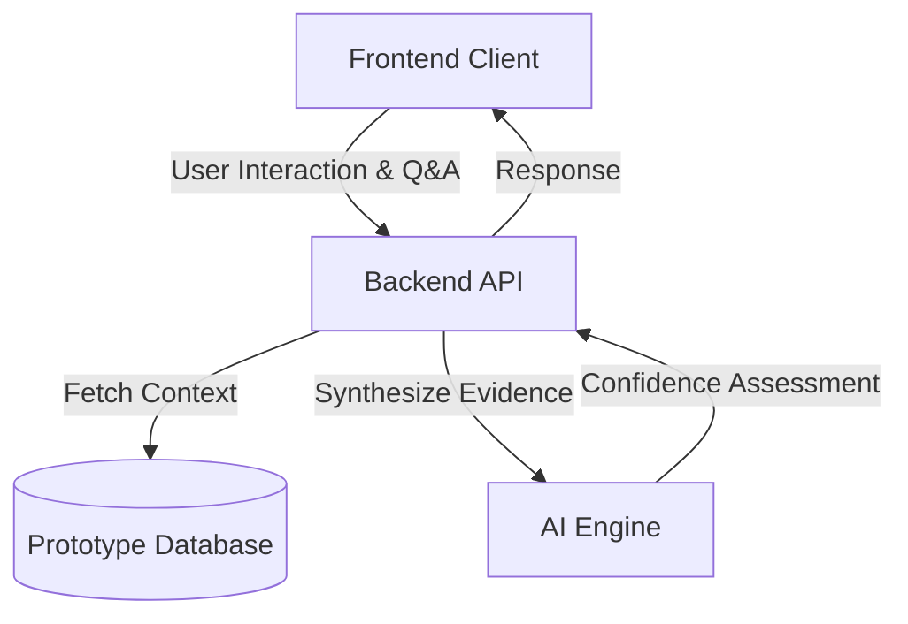
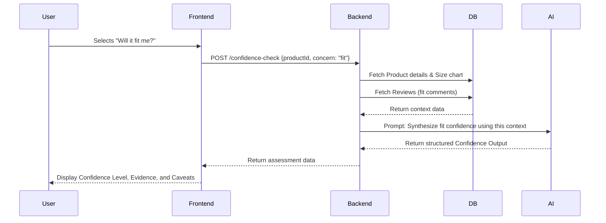
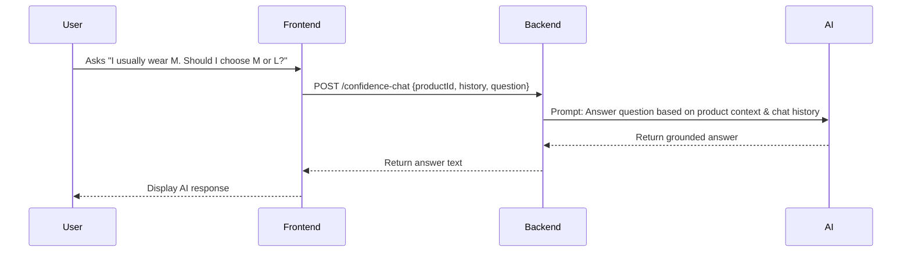

# AJIO Confidence Check MVP - Architecture

## 1. System Overview
The AJIO Confidence Check MVP is an AI-powered decision-support layer integrated into the product detail/wishlist experience. It is designed to synthesize product data, reviews, and sizing information to provide evidence-backed answers to users' purchase-related uncertainties (Fit, Quality, Trust).

The architecture prioritizes **functional clarity, evidence grounding, and realistic product behavior** using a small, controlled dataset, as defined in the product requirements.

## 2. High-Level Architecture

The system consists of four primary layers:
1.  **Frontend (User Interface):** A mock AJIO web/mobile interface focusing on the wishlist and product details page.
2.  **Backend Services (API & Orchestration):** Handles business logic, session state, and coordinates with the AI Engine.
3.  **AI Engine:** The LLM integration responsible for synthesizing evidence and generating confidence assessments.
4.  **Data Layer:** A localized or simplified database storing the prototype catalog and reviews.

## 3. Core Components

### 3.1 Frontend Client
- **Responsibilities:**
  - Display the wishlisted product details.
  - Render the "Confidence Check" entry point and modal.
  - Handle user selections (Fit, Quality, Trust).
  - Display AI-generated confidence assessments, evidence, and caveats.
  - Handle the chat interface for follow-up questions.
- **MVP Tech Stack:** React.js / Next.js (or similar modern web framework).

### 3.2 Backend API
- **Responsibilities:**
  - Serve product and review data to the frontend.
  - Construct prompts for the AI Engine by combining user queries with retrieved product/review context (RAG pattern).
  - Enforce AI design principles (evidence-grounded, no unsupported claims).
  - Log interactions for metrics tracking (Confidence Check usage, progression to Add to Bag).
- **MVP Tech Stack:** Node.js (Express/NestJS) or Python (FastAPI/Flask).

### 3.3 AI Engine
- **Responsibilities:**
  - Process structured product information, size charts, and reviews.
  - Generate a concise, explainable confidence summary based *only* on provided evidence.
  - Answer follow-up questions while maintaining a grounded, uncertainty-aware tone.
- **MVP Tech Stack:** OpenAI GPT-4o / Anthropic Claude 3.5 Sonnet (via API) with strict system prompts guiding behavior.

### 3.4 Data Layer
- **Responsibilities:**
  - Store the small, controlled dataset (catalog, reviews).
- **MVP Tech Stack:** PostgreSQL, MongoDB, or static JSON files for a simplified MVP setup.

## 4. Data Model

As defined in the problem statement, the MVP uses a controlled dataset:

### 4.1 Product
- `product_id` (String)
- `product_name` (String)
- `category` (String)
- `price` (Number)
- `material` (String)
- `brand` (String)
- `size_chart` (JSON/Object)
- `delivery_information` (String)
- `return_information` (String)

### 4.2 Review
- `review_id` (String)
- `product_id` (String, foreign key)
- `rating` (Number)
- `review_text` (String)
- `fit_comment` (String)
- `quality_comment` (String)
- `delivery_comment` (String)
- `recommendation_comment` (String)

### 4.3 Confidence Output (AI Response Structure)
- `concern_type` (String: Fit, Quality, Trust)
- `confidence_level` (String: High, Medium, Low, Insufficient Evidence)
- `evidence_points` (Array of Strings)
- `positive_signals` (Array of Strings)
- `negative_signals` (Array of Strings)
- `recommendation` (String)
- `caveat` (String)

## 5. Core Workflows

### 5.1 Initial Confidence Check Request

### 5.2 Follow-up Question

## 6. AI Guardrails & Prompt Engineering Strategy

To meet the AI Design Principles (Evidence-grounded, Transparent, Uncertainty-aware):
- **System Prompting:** The LLM will be instructed to *never* invent information. If the answer is not in the context, it must reply with "Insufficient evidence."
- **Retrieval-Augmented Generation (RAG):** The backend will inject the exact product context (JSON format) into the prompt alongside the user's question.
- **Structured Output:** The AI will be forced to return JSON matching the `Confidence Output` data model to ensure the UI can render it cleanly (using JSON mode or function calling).
